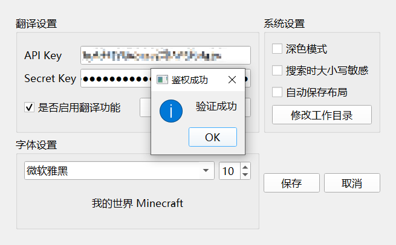

## JSON-i18n

JSON文件快速本地化的翻译工具

部分功能参考自[CFPATools/Minecraft-Mods-Translator: Mods Translator for Minecraft 1.16+ (github.com)](https://github.com/CFPATools/Minecraft-Mods-Translator)

### 主要功能：

- 对接[Minecraft模组翻译参考词典 (mcmod.cn)](https://dict.mcmod.cn/)，可以在程序内直接进行查询
- 对接[文本翻译_机器翻译-百度AI开放平台 (baidu.com)](https://ai.baidu.com/tech/mt/text_trans)，可以一键对全文进行机器翻译
- 可以快速替换值中的单词而不会影响键名
- 支持切换深色模式与浅色模式，支持修改ui文字样式大小、保存布局后再次启动后自动应用、(进阶)提供对ui的高度自定义设置

程序提供五个快捷键：

- Ctrl+F 跳转至搜索
- Ctrl+H 跳转至替换
- Ctrl+Shift+A 全选替换候选项
- Ctrl+Up(方向键上) 跳转至审阅模式上一个键名
- Ctrl+Down(方向键下) 跳转至审阅模式下一个键名

### 详细说明：

#### 首次启动：

首次启动后需要设置工作目录，设置完成后也可以在左上角 `选项-首选项`中修改

注意：请避免通过直接修改config.ini的方式修改配置，由于不同设备的文本编辑器编码方式可能不同，错误的编码方式会导致程序异常。如果出现此类情况请删除config.ini以初始化程序

#### 外观设置：

程序内支持修改全局字体及大小，在左上角 `选项-首选项`中修改。使用鼠标滚轮可以快速调整不同的字体及大小，方便预览。同时支持切换深色模式

#### 界面说明

程序左侧为文件浏览区域，可以快速选择需要打开的json文件

程序右侧分别是查询栏和替换栏

程序中间为操作区域，用来编辑json文件，在浏览模式下点击行号可以快速跳转到审阅模式

#### 翻译功能：

翻译功能需要首先前往[百度智能云-管理中心 (baidu.com)](https://console.bce.baidu.com/ai/?_=1652768945367&fromai=1#/ai/machinetranslation/overview/resource/getFree)获取免费测试资源（500万字符/年），后续将陆续支持其他翻译api。

使用前需要在配置文件中填入获取到的接口ak/sk，具体步骤见下文。

测试成功后，可以点击左下角 `翻译文件`按钮，程序将自动对全文进行翻译。此时翻译并不会直接替换原文，需要用户进行进一步校对。如不需要，可以点击左下角 `复制机翻`按钮，一键替换译文与原文。完成后点击左下角 `保存文件`按钮即可保存更改。

##### 翻译接口领取步骤：

1、登录百度账号，选择领取 `文本翻译-通用版`

2、创建应用，接口选择 `文本翻译-通用版`，其他内容无要求

3、复制ak与sk到程序中，测试成功后即可使用

### Todo:

1. ~~一键删除空格~~
2. ~~替换功能查找到对应键后点击可以跳转到列表对应位置/项目复选框~~
3. ~~完善关于信息~~
4. ~~gui格式配置文件（关闭程序时自动保存~~
5. ~~字体大小等配置界面~~
6. ~~左下角按钮汉化~~
7. ~~暗色模式~~
8. ~~隐藏cmd（日志在gui底部输出~~
9. ~~文件路径支持中文~~
10. ~~查找区分大小写选项~~
11. ~~暗色模式下焦点选中的单元格颜色过亮~~
